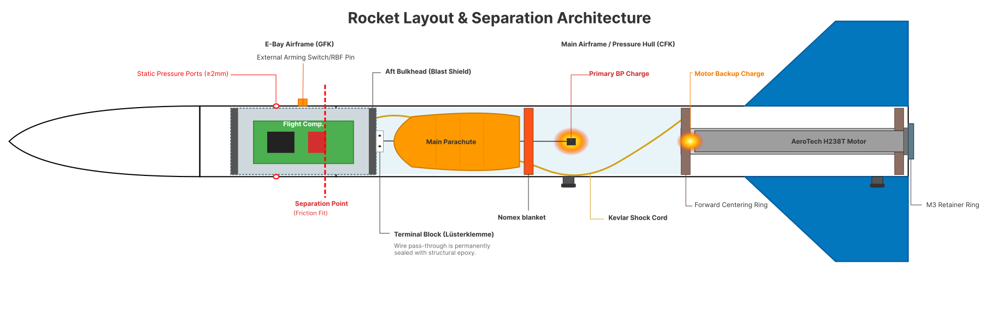

# FIRST Project: Rocket Design Decisions & Architecture

This document outlines the major architectural and design decisions made for our TU Space Team FIRST project rocket. These decisions were driven by the constraints outlined in the `reviews-and-technical-requirements.pdf` and the `how-to-rocketry-UoF.pdf` guidelines.

## 1. Airframe and Aerodynamics
* **Diameter Selection for Altitude Control:** We opted for a wider body tube diameter (70mm) rather than a minimum-diameter design. The larger cross-sectional area generates natural aerodynamic drag, ensuring the simulated altitude strictly remains $\le 600m$ (Req 4.4) given the high thrust of the AeroTech H238T motor. This also provides ample volume for easier parachute packing and avionics integration.
* **Boat Tail & Fin Placement:** Initial designs included an aft boat tail, but simulation in OpenRocket revealed it pulled the Center of Pressure (CP) forward, reducing our stability margin. Furthermore, narrowing the aft end exposed the fin roots. To comply with the stability margin requirement ($s > 0.1 * L$ and $s = 1-2$ calibers, Req 4.1) and to prevent the fins from breaking upon ground impact (How to Rocketry 1.3), we rely on a standard cylindrical aft section where fins do not protrude past the bottom of the body tube.
* **Materials:** * Main pressure hull and airframe: Carbon Fiber (CFK) for high stiffness-to-weight ratio.
  * Avionics bay section: Glass Fiber (GFK) to allow radio transmissions, as CFK is electrically conductive and acts as a Faraday cage.
  * Internal sleds: 3D printed in PC or ASA (avoiding PLA due to low heat resistance near pyrotechnics).

## 2. Motor Mount Assembly
* **Dimensions:** Per Requirement 5, the internal motor tube is designed to a length of $\approx 250mm$ to accommodate the 29mm AeroTech motor with 4 grains. (Note: The bare H238T casing in OpenRocket is shorter, but the 250mm tube accounts for the forward closure, ejection cap, and thermal margins).
* **Thrust Transfer & Retention:** Thrust is transferred via the motor casing's aft lip pressing against the bottom edge of the motor tube. To prevent the motor from being expelled backwards during the backup ejection charge, we utilize an aft retainer ring secured by three M3 screws spaced at 120°, per the schematic in How to Rocketry Section 2.

## 3. Stacking Order & Recovery Architecture
To ensure the redundant ejection systems function correctly, the rocket utilizes the following stacking order from aft to forward: **[Motor Mount] $\rightarrow$ [Parachute Compartment] $\rightarrow$ [E-Bay] $\rightarrow$ [Nosecone]**.

* **Shared Pressure Hull (Rule 9.2):** This specific stacking order places the primary black powder charge and the motor's backup ejection charge (Req 7) within the exact same pressure hull (the lower airframe). When either charge fires, the pressure pushes against the E-Bay's aft bulkhead, forcing the friction fit to separate and dragging the Kevlar shock cord and parachute out into the airstream.
* **Descent Rate:** The main parachute is sized to achieve a descent velocity between $10 m/s$ and $15 m/s$ (Req 4.3). It is protected from the explosive charges using a Nomex blanket/cellulose wadding.

## 4. E-Bay (Avionics Bay) and Rule 9.4 Compliance
* **Sealing (Req 8):** The flight computer is housed in a coupler tube completely sealed off by forward and aft bulkheads. This ensures the electronics are entirely isolated from the corrosive and hot fumes of both black powder and delay charges.
* **Static Ports:** At least two $\ge 2mm$ holes are drilled symmetrically into the GFK airframe over the E-Bay to allow the barometric altimeter to detect apogee.
* **Ignition Wiring (Rule 9.3 & 9.4):** The primary BP charge must be wired to the flight computer (9.3) but physically separated to prevent damage (9.4). To achieve this without compromising the E-Bay seal:
  1. A small screw terminal block (Lüsterklemme) is mounted on the *outside* face of the E-Bay's aft bulkhead.
  2. The internal ignition wires pass through a minimal hole into the terminal block.
  3. The pass-through hole is permanently filled and hermetically sealed with high-temp structural epoxy. 
  4. On launch day, the e-match wires from the BP capsule are simply screwed into the terminal block.

## 5. System Architecture Diagram

